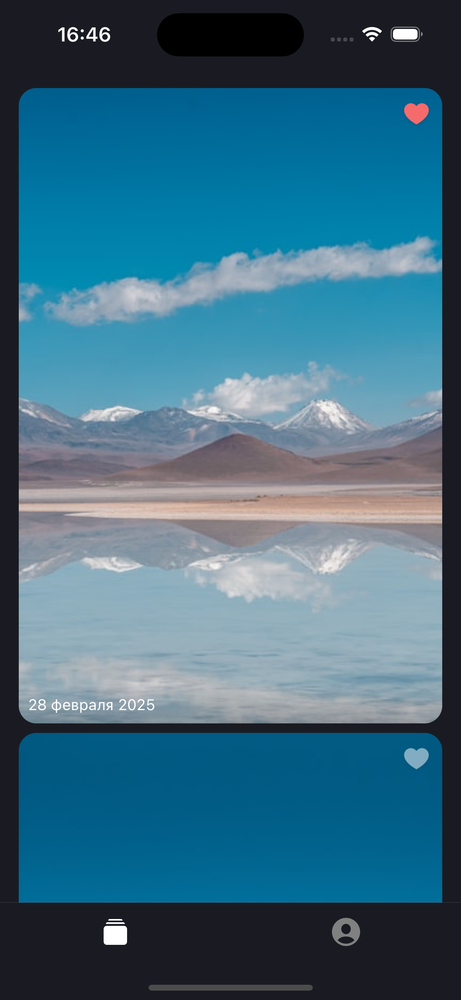
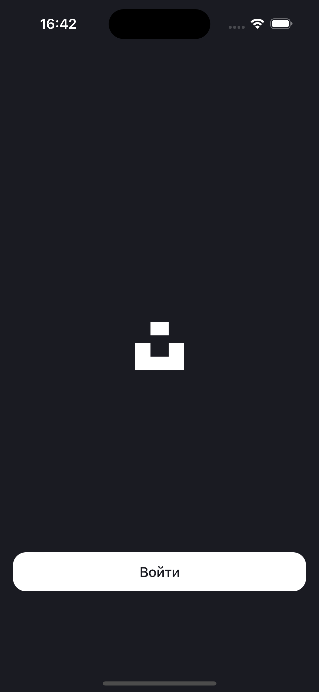
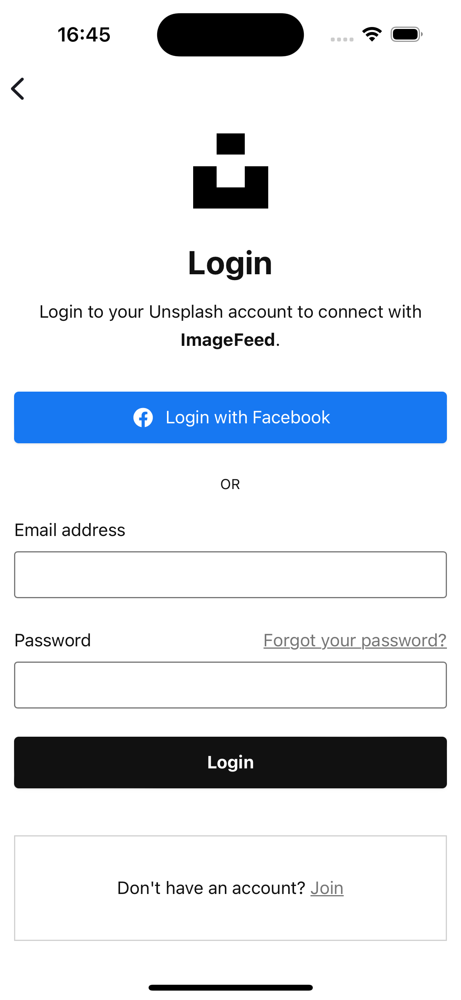

# Image Feed

### 📱 iOS

### 🌐 Networking & Libraries

### 🧪 Tests & Workflow

---

## 📖 Description  
Image Feed is a mobile app for iPhone (iOS 13+) that lets users enjoy an endless stream of images from Unsplash. After logging in via Unsplash OAuth, you can browse, like, and share stunning photos. The app offers a user-friendly interface with a feed, full-screen image view, and a personal profile. Simple, stylish, and intuitive — perfect for visual content enthusiasts.

---

## 🔗 Links
- [📷 Unsplash API](https://unsplash.com/documentation)

---

## 📸 Screenshots

| 📰 Feed                   | 🔍 Detail                  |
|---------------------------|----------------------------|
| |  |

| 🔑 Authorization          | 🌐 WebView                 |
|---------------------------|----------------------------|
| |  | 

---

## 🎯 Purpose and Goals of the Application
The multi-page application is designed for viewing images via the Unsplash API.

**Goals of the application:**
- View an infinite feed of images from Unsplash Editorial.
- View brief information from a user’s profile.

---

## 📝 Brief Description of the Application
- The application requires authorization via Unsplash OAuth.
- The main screen consists of an image feed. Users can browse it, add images to favorites, and remove them from favorites.
- Users can view each image individually and share links to them outside the application.
- Users have a profile with favorite images and brief user information.
- The application has two versions: basic and extended. The extended version includes a favorites mechanic and the ability to like photos when viewing them in full-screen mode.

---

## ⚙️ Non-Functional Requirements

### 💻 Technical Requirements
1. Authorization is implemented via Unsplash OAuth and a POST request to obtain an Auth Token.
2. The feed is implemented using `UITableView`.
3. The application uses `UIImageView`, `UIButton`, `UILabel`, `TabBarController`, `NavigationController`, `NavigationBar`, `UITableView`, and `UITableViewCell`.
4. The application must support iPhone devices with iOS 13 or higher, and only portrait mode is supported.
5. All fonts in the application are system fonts; no additional downloads are required. In Interface Builder, this is the "System" font from the dropdown list, and in code, it’s [`systemFont(ofSize:weight:)`](https://developer.apple.com/documentation/uikit/uifont/1619027-systemfont).

---

## ✅ Functional Requirements

### 🔐 Authorization via OAuth
To access the application, the user must log in via OAuth.

**The authorization screen includes:**
1. Application logo  
2. "Login" button  

**Algorithms and available actions:**
1. Upon launching the application, the user sees a splash screen.  
2. After the application loads, the authorization screen appears.  
   1. Clicking the "Login" button opens a browser on the Unsplash authorization page.  
      1. Clicking "Login" in the browser closes it, and a loading screen appears in the app.  
      2. If Unsplash OAuth authorization is not configured, clicking the login button does nothing.  
      3. If Unsplash OAuth authorization is incorrectly configured, the user cannot log into the app.  
      4. If the login attempt fails, a modal window with an error message appears.  
         1. Clicking "OK" returns the user to the authorization screen.  
      5. If authorization is successful, the browser closes, and the app opens the feed screen.  

---

### 📰 Viewing the Feed
In the feed, users can browse images, view individual images, and add them to favorites.

**The feed screen includes:**
1. Image card:  
   - Like button  
   - Upload date of the photo  
2. Tab bar for navigation between the feed and profile.  

**Algorithms and available actions:**
1. The feed screen opens by default after logging into the app.  
2. The feed contains images from Unsplash Editorial.  
3. Users can scroll up and down to browse the feed.  
   - If an image hasn’t loaded yet, a system loader is displayed.  
   - If an image cannot be loaded, a placeholder is shown instead.  
4. Clicking the Like button (grey heart) allows the user to like an image.  
   - If the request is successful, the button changes to a red heart.  
   - If the request fails, a modal window with the error "Try again" appears.  
5. Users can unlike an image by clicking the Like button (red heart).  
   - If the request is successful, the button changes back to a grey heart.  
   - If the request fails, a modal window with the error "Try again" appears.  
6. Clicking an image card enlarges it to the phone’s boundaries, transitioning to the full-screen image view.  
7. Clicking the profile icon allows the user to go to their profile.  
8. Users can switch between the feed and profile screens using the tab bar.  

---

### 🖼️ Viewing Image in Full Screen
From the feed, users can view an image in full screen and share it.

**The screen includes:**
1. Enlarged image filling the phone’s boundaries.  
2. Back button to return to the previous screen.  
3. Button to download the image or share it.  

**Algorithms and available actions:**
1. When opening an image in full screen, the user sees it stretched to the screen’s boundaries.  
   - If the image cannot be loaded, a placeholder is shown.  
   - If no response is received, a system alert with an error appears.  
2. Clicking the Back button returns the user to the feed screen.  
3. Using gestures, users can move, zoom, and rotate the image.  
4. Clicking the Share button opens a system menu where the user can download or share the image.  

---

### 👤 Viewing User Profile
Users can visit their profile to view profile data or log out.

**The profile screen includes:**
1. Profile data:  
   - User photo  
   - Name and username  
   - Bio/about information  
2. Logout button  
3. Tab bar  

**Algorithms and available actions:**
1. Profile data is loaded from Unsplash. If unavailable, placeholders are shown.  
2. Clicking the Logout button opens a system alert to confirm logout.  
   - Clicking "Yes" logs the user out and opens the authorization screen.  
   - Clicking "No" returns the user to the profile screen.  
3. Users can switch between the feed and profile screens using the tab bar.  
